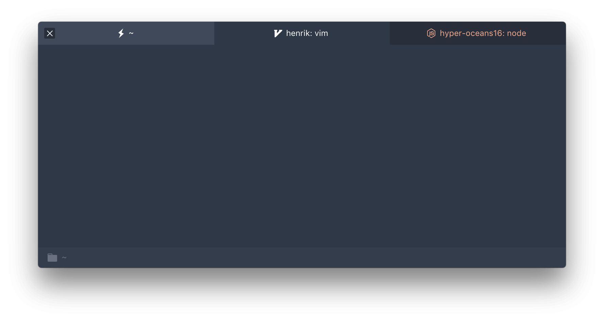

# hyper-oceans16   

> Oceans16 Theme for [Hyper](https://hyper.is) based on [Jupyter](https://github.com/dunovank/jupyter-themes) schemes.

## Install

Add `hyper-oceans16` to the plugins array in your `~/.hyper.js` config.

## Plugins

* [hyper-tabs-enhanced](https://github.com/henrikdahl/hyper-tabs-enhanced)
* [hyper-statusline](https://github.com/henrikdahl/hyper-statusline)

## Other

* [hyper-chesterish](https://github.com/henrikdahl/hyper-chesterish)

## License

MIT © Henrik
