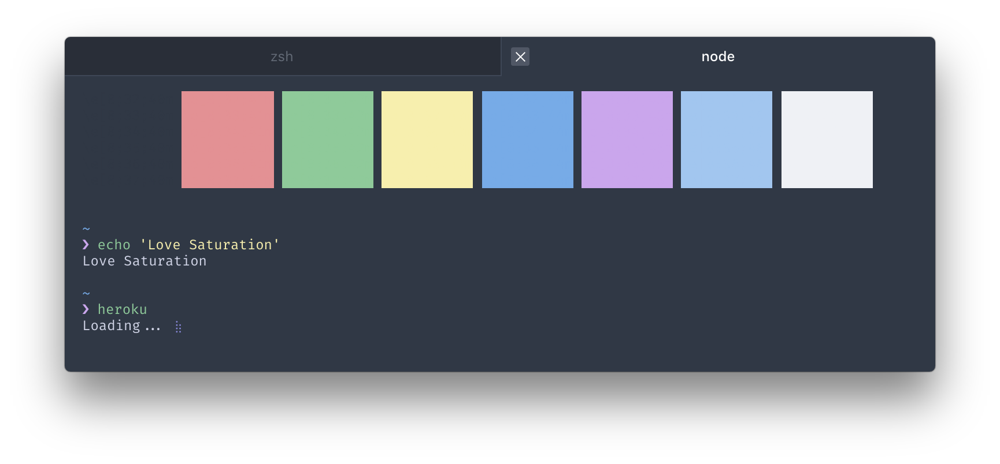
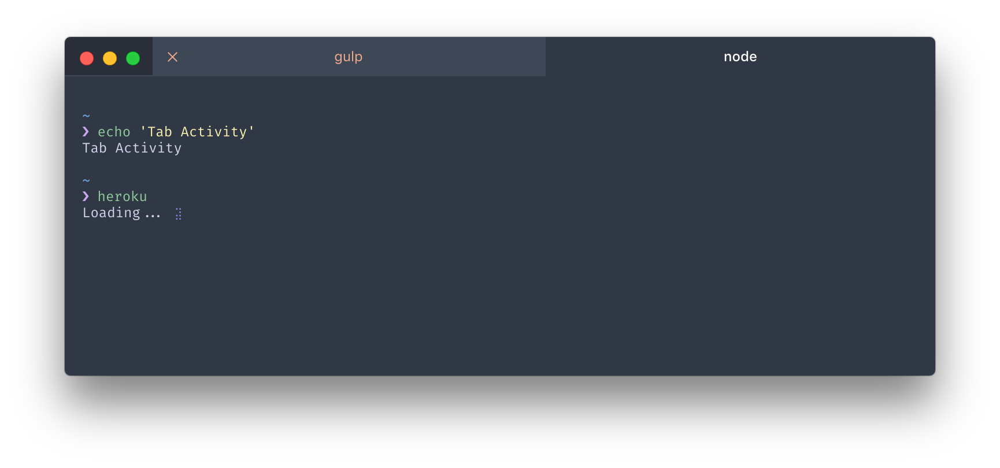

# hyperterm-base16-ocean-saturated

> Saturated Base 16 Ocean Theme for [HyperTerm](https://hyperterm.org) based on [Base 16 Ocean](https://github.com/dunovank/oceans16-syntax) scheme.

## Install

Add `hyperterm-base16-ocean-saturated` to the plugins array in your `~/.hyperterm.js` config file and full reload.

## Additional

Screenshot also uses [Pure](https://github.com/sindresorhus/pure) prompt, [zsh-syntax-highlighting](https://github.com/zsh-users/zsh-syntax-highlighting) plugin for command highlights and [Fira Code](https://github.com/tonsky/FiraCode) as font.

Inspired by [Snazzy](https://github.com/sindresorhus/hyperterm-snazzy).

## License

MIT
